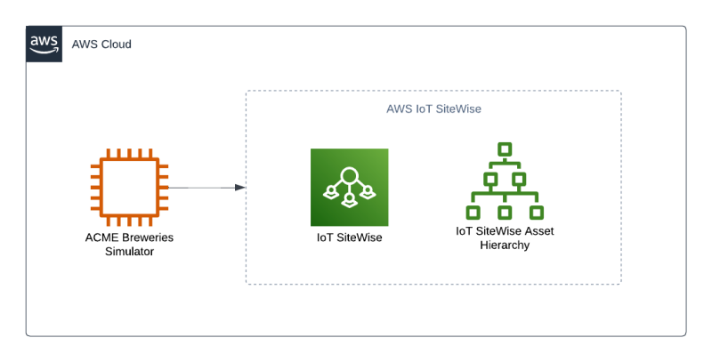

# ACME Breweries SiteWise Simulator - Getting Started

## Summary

ACME Breweries is a Python based simulation program to exercise the capabilities of IoT SiteWise (Monitor), IoT Greengrass, IoT TwinMaker, and other IoT based AWS services that constantly runs and produces factory like data exposed via an OPC UA Server (a cross-platform, open-source, IEC62541 standard for data exchange from sensors to cloud applications developed by the OPC Foundation) for consumption by an OPC UA Client (like the IoT SiteWise OPC UA Collector). In addition, you can configure the publishing of values directly to IoT SiteWise at a specified interval. 

 - Example Command to publish data to IoT SiteWise every 5 seconds to us-west-2:
      ```
      python3 awsBrewSimServer.py --publishtositewise=True --interval=5 --region=us-west-2

      ```

Feel free to run this python simulator in your own environment manually or through a quick deploy using the cloudformation template below.

## Simulation Description
      
This simulator program creates factory like quality data.  This section of the getting started guide will describe how the ACME Brewery works so you can have a better understanding of how to use and leverage the industrial data provided by the brewery. 

The diagram below is an view of the brewery material flow for the Irvine plant. ACME Brewery simulates production and consumption of items through the process below. This includes good production, scrap, and simulation of various utilization states. Telemetry data is also generated at the various operations for temperature and levels. With the data produced by this simulation, metrics are calculated in the SiteWise Models for OEE (Utilization, Performance, and Quality).


## Quick Deploy

Quick deploy will use cloudformation to setup an EC2 instance to run the simulator and publish values directly to IoT SiteWise, as seen in the architecture below:



1. Log on to your AWS Console.
2. Click on this link to install the CloudFormation template on your account.
3. Once complete, you will start to see live values stored in IoT SiteWise. 

## Manual Install

1. Identify a system (Linux, Windows, or macOS) to host the brewery simulator Python program.

2. [Python3](https://www.python.org/downloads/)
   - Verify your python3 path and version (<b>needs to be 3.10.0+</b>). 
     ```
     python3 --version

     ```
3. Install the OPC UA Server Python Library

    - With pip:
      ```
      pip install opcua

      ```

    - Ubuntu:
      ```
      apt install python-opcua        # Library
      apt install python-opcua-tools  # Command-line tools

      ```

    - Dependencies:
      ```
      cryptography, dateutil, lxml and pytz.

      ```

4. Clone this respository to your environment.
      ```
      git clone https://REPO

      ```

5. Log in to your AWS Console and deploy this cloudformation template to configure all your IoT SiteWise Models and Assets.

### (Option A) Ingest Data through and OPC UA Client like AWS IoT SiteWise Edge Gateway

If you are seeking to ingest data through OPC, you can use AWS IoT SiteWise Edge gateway to ingest this data. A Greengrass component can be created to make this simualtor deployable. Feel free to do this yourself until component sample is released or run it manually on your edge device. Below is a example architecture of this integration:


6. Create an Edge Device (Ubuntu 20.04 or 18.04, Red Hat Enterprise Linux (RHEL) 8, or Amazon Linux 2) to host AWS IoT SiteWise Edge gateway.  

7. Create and deploy the AWS IoT SiteWise Edge gateway to the Edge Device, please use this URL for reference - https://docs.aws.amazon.com/iot-sitewise/latest/userguide/configure-gateway-ggv2.html. The Data processing pack is not required.

    - <b>Note: When configuring the OPC UA datasource in the IoT SiteWise (or any 3rd party OPC UA Client), set the "Message security mode" to "None" and the "Authentication configuration" to "None - No authentication".  The simulator OPC UA Server program has not been tested with encryption or certificates for this current version of the program.</b>          

8. Run the script below to start the simulation and OPC UA Server. If this were a custom Greengrass component, it would run this command for you.
```
python3 awsBrewSimServer.py --publishtositewise=False --region=us-west-2

```

### (Option B) Publish values directly to AWS IoT SiteWise

9. If you would like to simply publish values directly to IoT SiteWise, run the command below. It will publish values at the interval provided:
```
python3 awsBrewSimServer.py --publishtositewise=True --interval=5 --region=us-west-2

```
